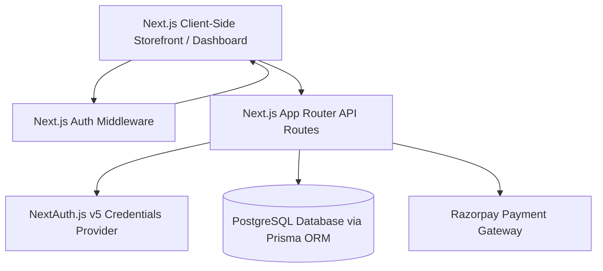
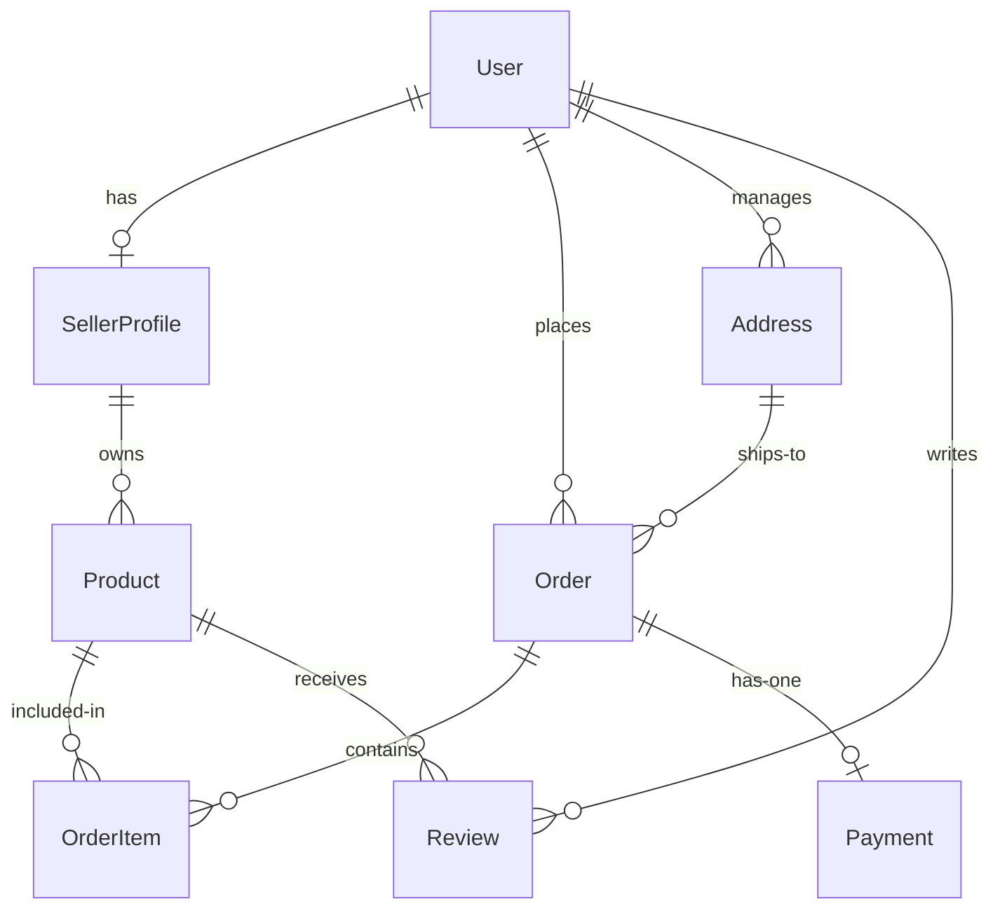

# ⚡ Secufur Smart Solutions: Unified E-Commerce Platform

Welcome to the **Secufur Smart Solutions** unified e-commerce platform, custom-engineered for premium batteries, bespoke electronics, and customized battery pack architectures. 

This repository houses the entire codebase, including the buyer-facing storefront, the merchant-facing dashboard, the administrator control portal, secure credentials authentication middleware, and database-backed Next.js route handlers.

---

## 🗺️ Developer Site Map
For a complete visual layout of all paths, components, and pages inside this unified repository, please check the **[SITEMAP.md](./secufur-smart-solutions-unified/SITEMAP.md)** file.

---

## 🏗️ Technical Architecture & Ecosystem

- **Frontend & App Framework**: Next.js App Router (unified routing layout), TypeScript, and Tailwind CSS.
- **Database & Data Access Layer**: PostgreSQL hosted on AWS RDS, queried dynamically via **Prisma ORM**.
- **Security & Session Authentication**: **NextAuth.js v5** protecting backend API routes and merchant dashboards via server-side session guards.
- **Payment Processor**: **Razorpay** SDK integration with secure HMAC-SHA256 signature verification route handlers.
- **Hosting Target**: **AWS Amplify Console** (Frontend & Route Handlers) + **AWS RDS** (PostgreSQL instance).

---

## 🔑 Dummy Credentials for Testing (All Roles)

Use these credentials to sign in and test each segment of the platform:

| Role | Email | Password | URL Destination | Context |
| :--- | :--- | :--- | :--- | :--- |
| **👑 Admin** | `admin@secufur.in` / `admin@luvarte.in` | `admin123` | `/admin/login` | Portal supervisor |
| **💼 Seller** | `seller@secufur.in` / `admin@luvarte.in` | `admin123` | `/seller/auth` | Merchant Central V2.5 |
| **🛒 Buyer** | `buyer@secufur.in` | `Password123` | `/buyer/sign-in` | Storefront |

*Note: For the buyer role, you can also use `/buyer/sign-up` to register real, permanent accounts in your local PostgreSQL database.*

---

## 📡 Core API Route Handlers

All routes are fully authenticated and validate JSON formats via Next.js App Router standards under `src/app/api/...`:

### 🔑 A. Buyer & User Authentication
- **`POST /api/auth/signup`**: Creates real customer records in the database, hashing passwords using `bcryptjs` under the `BUYER` role.
- **`POST /api/auth/signin`**: Validates buyer credentials against hashed database records and issues session identifiers.

### 📦 B. Product Catalog Management
- **`GET /api/products`**: Serves active listings matching optional parameters (`category`, `limit`, `search`). Dynamically computes average product scores from reviews.
- **`POST /api/seller/products`**: Secure endpoint for merchants to add products, including custom specifications stored as JSON in the database.

### 💳 C. Orders & Razorpay Payments
- **`POST /api/orders`**: Transactionally generates orders, payments, and order items using `prisma.$transaction`.
- **`POST /api/orders/[id]/payment/init`**: Contacts Razorpay servers to initiate a transaction (measured in paisa) and logs the local `razorpayOrderId`.
- **`POST /api/orders/[id]/payment/verify`**: Receives web-signature metadata, validates signatures via cryptography (HMAC-SHA256), and upgrades payment statuses to `SUCCESS` in the database.

---

## 🗄️ Database Entity Schema (ERD)

